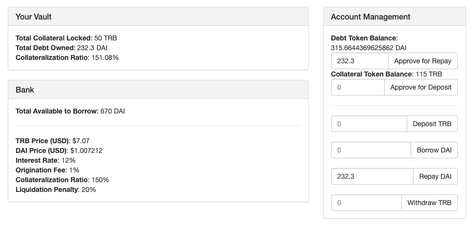

This is a framework for managing a collateral-backed loans on Ethereum. This repository contains the core smart contracts and DApp code.

# Hack Money Development Plan
## Phase 1: Tokenless Protocol
First, make the protocol work without transferring tokens around. Build and test that all of the protocol functionality can work correctly without moving tokens around.

### Tasks:
- [x] Develop smart contract code
- [x] Write tests for the smart contract
- [x] Build a Customer UI for interacting with the contract

## Phase 2: Token Integration
Second, make the protocol work with transferring tokens for collateral and debt. Use a `updatePrice` function to manually enter the collateral and debt token prices.

### Tasks:
- [x] Develop support for depositing collateral and borrowing
- [x] Create a test plan for testing locally (how to deploy test ERC20 tokens to use?)
- [x] Create video demo running on localhost

## Phase 3: Oracle Integration
Finally, integrate the Tellor oracle for updating the collateral and debt token prices.

- [ ] Update price using Tellor Oracle
- [ ] Build Bank Owner UI
- [ ] Create video demo running on localhost


# Design Considerations

- Transparency
  - The contract code is simple enough to understand by anyone familiar with Solidity
  - It is easy to find where smart contract code is executed during contract interactions

- Flexibility
  - The contract code can be deployed in many configurations
  - The type of collateral, debt, and rates can all be changed

- Easy of Use
  - Deployment and configuration is simple enough for anyone familiar with Ethereum
  - Interactions with the contract are simple and intuitive for end users

# Protocol Summary
On deployment, the bank _owner_ specifies the following parameters:

* **Debt Token:** This is the token users borrow from the bank (i.e. USDC)
* **Collateral Token:** This is the token the bank accepts as collateral (i.e. TRB)
* **Interest Rate:** The annual interest rate the bank charges borrowers
* **Origination Fee:** The fixed fee charged to borrowers
* **Collateralization Ratio:** The loan-to-value amount borrowers must maintain to avoid a liquidation
* **Liquidation Penalty:** The fixed fee charged to borrowers who get liquidated

Once deployed, the bank owner must deposit some debt tokens into the bank's reserve. After depositing debt tokens, users can deposit collateral tokens and borrow the bank's debt tokens. During the borrow, the borrower is charged an origination fee and then interest will accumulate until they repay what they've borrowed plus interest and fees. If at anytime the price of the collateral falls, then the bank owner will liquidate the borrowers collateral to repay their debt.

# Usage on Ganache
First, `truffle migrate` the contract to deploy to Ganache, then setup the contract using `truffle console`.

From the console, approve and deposit debt tokens (i.e. `USDToken`) into the bank's reserve.
```
let bank = await Bank.deployed()
let dt = await USDToken.deployed()
let accounts = await web3.eth.getAccounts()
await dt.approve(bank.address, web3.utils.toWei("100", "ether"), {from: accounts[0]})
await bank.reserveDeposit(web3.utils.toWei("100", "ether"), {from: accounts[0]})
```
